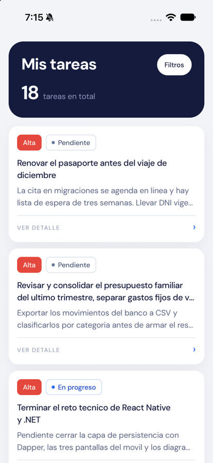

# Task Manager — reto técnico

Mini aplicación de gestión de tareas personales: **listar, filtrar y ver el detalle**.
Solo lectura, por diseño.

| Pieza | Stack |
|---|---|
| Móvil | React Native CLI 0.87 + TypeScript, sin librerías de UI |
| API | .NET 10 (LTS), arquitectura hexagonal |
| Datos | PostgreSQL 16 en Docker, acceso exclusivo por procedimientos almacenados |



> El **porqué** de cada decisión está en [`docs/decisions`](docs/decisions/README.md).
> El reto valora más el criterio que el código, así que ese es el mejor sitio por donde
> empezar a leer.

---

## Prerrequisitos

| Herramienta | Versión | Verificar con |
|---|---|---|
| .NET SDK | **10.0.x** | `dotnet --list-sdks` |
| Docker Desktop | reciente | `docker --version` |
| Node.js | 22 LTS o superior | `node -v` |
| Xcode (iOS) | 16 o superior | `xcodebuild -version` |
| Android Studio + JDK 17 (Android) | reciente | `java -version` |

Para iOS solo hace falta Xcode; para Android solo Android Studio. No necesitas ambos.

---

## Puesta en marcha

### 1. Base de datos

```bash
docker compose up -d
```

Levanta PostgreSQL 16 en el puerto **5433** del host (el 5433 evita chocar con un
PostgreSQL que ya tengas instalado). Los scripts de `database/` se ejecutan solos:
esquema, procedimientos almacenados y 18 tareas de ejemplo.

Comprobar que quedó lista:

```bash
docker compose ps                     # debe decir "healthy"
docker exec taskmanager-db psql -U taskmanager -d taskmanager \
  -c "SELECT count(*) FROM tasks;"    # debe devolver 18
```

### 2. API

```bash
cd backend
dotnet run --project src/TaskManager.Adapters.Rest
```

Queda escuchando en **http://localhost:5080**. Comprobar:

```bash
curl http://localhost:5080/health
# {"status":"Healthy","checks":[{"name":"database","status":"Healthy", ...}]}
```

Documentación interactiva de la API: **http://localhost:5080/swagger**

### 3. App móvil

```bash
cd mobile
npm install
```

**iOS**

```bash
bundle install --path vendor/bundle
cd ios && bundle exec pod install && cd ..
npm run ios
```

> Si `bundle install` falla al compilar el gem `json`, usa:
> `DEVELOPER_DIR=/Library/Developer/CommandLineTools bundle install --path vendor/bundle`
> El porqué está en [Problemas frecuentes](#problemas-frecuentes).

**Android**

Requiere Android Studio con *SDK Platform*, *Platform-Tools* y *Emulator*, más JDK 17.
Estas variables tienen que estar en tu `~/.zshrc`:

```bash
export JAVA_HOME=$(/usr/libexec/java_home -v 17)
export ANDROID_HOME=$HOME/Library/Android/sdk
export PATH=$PATH:$ANDROID_HOME/emulator:$ANDROID_HOME/platform-tools
```

Recarga con `source ~/.zshrc` y comprueba con `adb --version`. Después, con un
emulador abierto:

```bash
npm run android
```

### Probar en un teléfono físico

No hay link ni código QR: este proyecto usa React Native **CLI**, no Expo, así que la
app se instala como binario nativo. Dos ajustes son imprescindibles.

**1. Que la API escuche en la red, no solo en `localhost`:**

```bash
cd backend
dotnet run --project src/TaskManager.Adapters.Rest --urls http://0.0.0.0:5080
```

**2. Que la app apunte a la IP de tu computadora** (averíguala con
`ipconfig getifaddr en0`) en `mobile/src/config/env.ts`.

Después, en **iOS**: conecta el iPhone por cable, abre
`mobile/ios/TaskManagerApp.xcworkspace` en Xcode, en *Signing & Capabilities* elige tu
Apple ID como *Team* y cambia el *Bundle Identifier* a uno único, y ejecuta
`npm run ios -- --device`. La primera vez hay que confiar en el certificado desde
*Ajustes › General › VPN y gestión de dispositivos*. Con una cuenta gratuita de Apple
la firma caduca a los 7 días.

En **Android**: `npm run android` con el teléfono conectado y la depuración USB
activada, o genera el APK con `cd android && ./gradlew assembleRelease` para
instalarlo desde el propio teléfono.

El teléfono y la computadora deben estar en la misma red wifi.

---

## Endpoints

Base: `http://localhost:5080`

| Método | Ruta | Descripción |
|---|---|---|
| `GET` | `/api/v1/tasks` | Lista todas las tareas |
| `GET` | `/api/v1/tasks?status={code}` | Filtra por estado |
| `GET` | `/api/v1/tasks?priority={code}` | Filtra por prioridad |
| `GET` | `/api/v1/tasks?status={code}&priority={code}` | Combina ambos filtros |
| `GET` | `/api/v1/tasks/{id}` | Detalle de una tarea (404 si no existe) |
| `GET` | `/api/v1/catalogs/priorities` | Prioridades disponibles |
| `GET` | `/api/v1/catalogs/statuses` | Estados disponibles |
| `GET` | `/health` | Estado del servicio y de la base |

**Códigos válidos** — prioridad: `HIGH`, `MEDIUM`, `LOW` · estado: `PENDING`,
`IN_PROGRESS`, `COMPLETED`.

Los catálogos existen para que la app móvil no tenga esos códigos escritos a mano: si
mañana agregas una prioridad en la base, aparece sola en la pantalla de filtros.

### Ejemplos

```bash
curl "http://localhost:5080/api/v1/tasks?priority=HIGH&status=PENDING"

curl "http://localhost:5080/api/v1/tasks?priority=URGENTE"
# 400 con ProblemDetails (RFC 7807):
# {"title":"Filtro invalido",
#  "detail":"El valor 'URGENTE' no es valido para el filtro 'priority'.
#            Valores aceptados: HIGH, MEDIUM, LOW.", ...}
```

Todos los errores siguen RFC 7807 y nunca exponen stack traces ni la cadena de
conexión ([ADR 0011](docs/decisions/0011-escalabilidad-y-seguridad.md)).

---

## Pruebas

```bash
cd backend && dotnet test     # 59 pruebas
cd mobile  && npm test        # 16 pruebas
```

No se buscó cobertura total, sino cubrir lo que puede romperse de verdad: la
validación de filtros, el mapeo entre capas, los códigos de estado de los controllers,
la traducción de errores HTTP y la interacción de la pantalla de filtros.

---

## Estructura del repositorio

```
.
├── database/           # 01 esquema · 02 procedimientos · 03 datos
├── backend/
│   ├── src/
│   │   ├── TaskManager.Domain/                 # sin dependencias de NuGet
│   │   ├── TaskManager.Application/            # puertos y casos de uso
│   │   ├── TaskManager.Adapters.Rest/          # controllers y errores
│   │   └── TaskManager.Adapters.Persistence/   # Dapper sobre los SP
│   └── tests/
├── mobile/
│   └── src/            # app · features/tasks · shared · config
└── docs/
    ├── architecture.md
    ├── diagrams/       # hexágono · secuencia · modelo de datos
    └── decisions/      # 11 ADR
```

---

## Problemas frecuentes

### La app móvil no conecta con la API

Cada plataforma ve `localhost` de forma distinta:

| Plataforma | URL de la API | Por qué |
|---|---|---|
| Simulador iOS | `http://localhost:5080` | Comparte la red con tu Mac |
| Emulador Android | `http://10.0.2.2:5080` | `10.0.2.2` es el alias del host desde el emulador |
| Dispositivo físico | `http://<IP-de-tu-Mac>:5080` | Debe estar en la misma red wifi |

Ya está resuelto en `mobile/src/config/env.ts` para simulador y emulador. Para un
dispositivo físico, cambia ahí la IP.

### `bundle install` falla compilando el gem `json`

Error típico: `'ruby/config.h' file not found`.

El SDK de Xcode 26 y posteriores trae los cabeceros del Ruby del sistema en una ruta
que no coincide con la que espera ese Ruby. Los Command Line Tools sí la tienen:

```bash
DEVELOPER_DIR=/Library/Developer/CommandLineTools bundle install --path vendor/bundle
```

Solo es necesario al instalar los gems. Para `pod install` y para compilar, Xcode
normal funciona.

### No encuentro la ventana del simulador de iOS

En Xcode 27 Apple eliminó `Simulator.app`. Su reemplazo es **DeviceHub**:

```bash
open -a "/Applications/Xcode.app/Contents/Applications/DeviceHub.app"
```

### La app compila pero se cierra al abrir

Si el log dice `UIScene life cycle is required for apps built with this SDK`, la
plantilla de React Native está creando la ventana a la vieja usanza. Ya está corregido
en este repositorio con un `SceneDelegate` y el `UIApplicationSceneManifest` en
`ios/TaskManagerApp/Info.plist`.

### La API arranca y muere de inmediato

Si el error es `Falta la cadena de conexion 'ConnectionStrings:TaskManagerDatabase'`,
estás ejecutando fuera del entorno de desarrollo. Usa `dotnet run --project ...` sin
`--no-launch-profile`, o exporta `ASPNETCORE_ENVIRONMENT=Development`.

### Cambié los scripts de `database/` y no se aplican

Solo corren la primera vez, cuando el volumen está vacío. Para reaplicarlos:

```bash
docker compose down -v && docker compose up -d
```

Esto **borra los datos** del contenedor. Con el seed, es justo lo que quieres.

### El puerto 5433 ya está ocupado

Cambia el mapeo en `docker-compose.yml` (por ejemplo `"5434:5432"`) y ajusta el puerto
en `backend/src/TaskManager.Adapters.Rest/appsettings.Development.json`.
