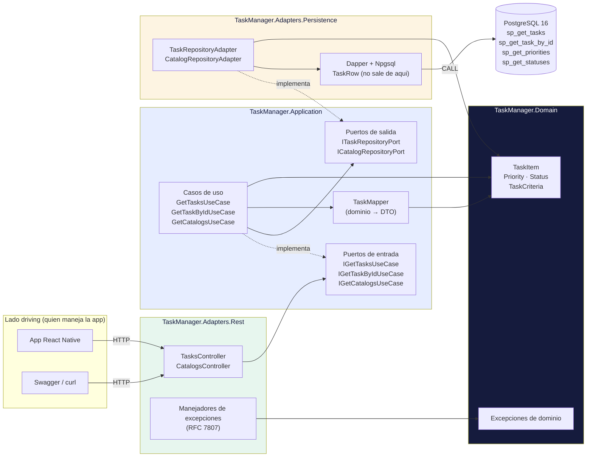

# Arquitectura del backend (hexagonal)

Las flechas indican **dependencia**: quien apunta conoce al apuntado. Todas terminan
en el dominio, nunca salen de él. Los adaptadores dependen de los puertos; los
puertos no saben que existen los adaptadores.

## Lo que hay que mirar en el diagrama

1. **El controller no conoce ninguna clase concreta.** Depende de `IGetTasksUseCase`,
   que vive en `Application`. Cambiar el caso de uso no toca el controller.
2. **El caso de uso no conoce Dapper.** Depende de `ITaskRepositoryPort`. Si mañana el
   origen de datos fuera un servicio externo en lugar de PostgreSQL, se escribe otro
   adaptador y el hexágono no se entera.
3. **`TaskRow` no cruza la frontera.** El adaptador de persistencia mapea sus filas a
   `TaskItem` antes de devolver. Ningún tipo de Dapper o Npgsql entra a `Application`.
4. **`Domain` no tiene un solo paquete NuGet.** Es la prueba de que la inversión de
   dependencias está bien aplicada y no solo dibujada.
