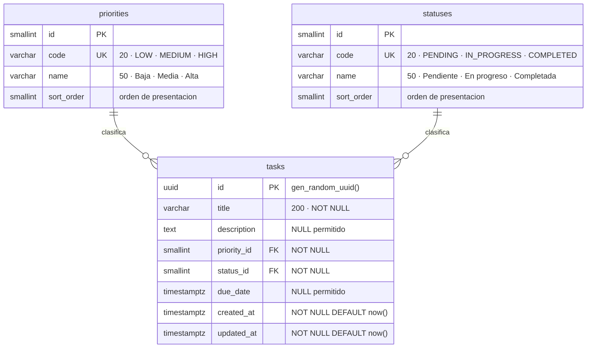

# Modelo de datos

## Por qué así

**Catálogos en vez de texto libre o enums en columna.** Si `priority` fuera un
`VARCHAR` suelto, nada impediría guardar `"ALTA"`, `"alta"` y `"Alta"` como tres
valores distintos. La llave foránea lo vuelve imposible: la base rechaza cualquier
prioridad que no exista. Y agregar una prioridad nueva es un `INSERT`, no una
migración de esquema ni un despliegue. El razonamiento completo está en el
[ADR 0006](../decisions/0006-catalogos-normalizados.md).

**`code` separado de `name`.** El `code` es el contrato con la API y no cambia nunca;
el `name` es lo que el usuario lee y puede traducirse o corregirse sin romper nada.

**Índices.**

| Índice | Para qué |
|---|---|
| `ix_tasks_status_priority (status_id, priority_id)` | Las cuatro combinaciones de filtro del listado |
| `ix_tasks_created_at (created_at DESC)` | El orden por defecto del listado |

Con 18 filas PostgreSQL ni los usa — hace un scan secuencial porque le sale más
barato. Están puestos pensando en que la tabla crezca, y es una decisión consciente,
no adorno: ver el [ADR 0011](../decisions/0011-escalabilidad-y-seguridad.md).
