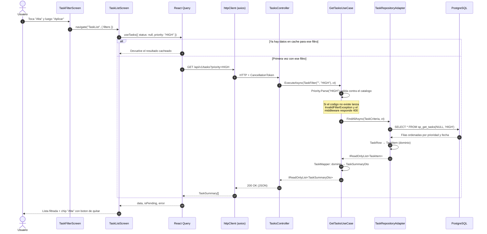

# Secuencia: el usuario filtra por prioridad Alta

Recorrido completo de un toque en la pantalla de filtros hasta el procedimiento
almacenado y de vuelta.

## Detalles que el diagrama deja ver

- **La cancelación viaja completa.** El `CancellationToken` nace en el controller y
  llega hasta Npgsql. Si el usuario sale de la pantalla, React Query aborta la
  petición y la consulta se cancela también del lado del servidor.
- **La validación ocurre antes de tocar la base.** Un filtro inválido nunca llega al
  procedimiento almacenado: el caso de uso lo rechaza contra el catálogo del dominio.
- **La caché evita el viaje.** Volver a un filtro ya consultado no genera petición
  HTTP mientras el dato siga fresco (60 segundos).
